# cs639-parallel-throughput-opt-prog

Parallel and Throughput-Optimized Programming by Prof. Sifakis

## Key takeaways

- With sparse matrices, it is important to identify patterns for transformations to result in reordering and parallelism performance at a divided level (i.e. a chunk of a larger full matrix or the factor in cholesky). **Think about using ML to apply the right set of transformations to achieve the right performance on sparsity** *engineering*.
- 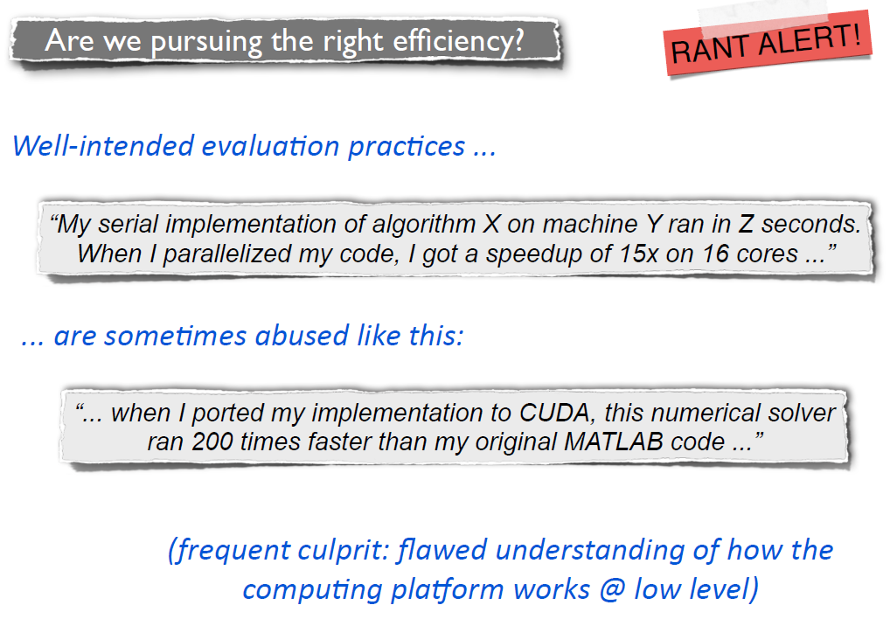
- Tips on C:
  - reinterpret_cast allows using [] with pointer to pointer
  - pd - packed scalar, double precision, ps - packed scalar, single precision, ss - single scalar
  - Auto-vectorization 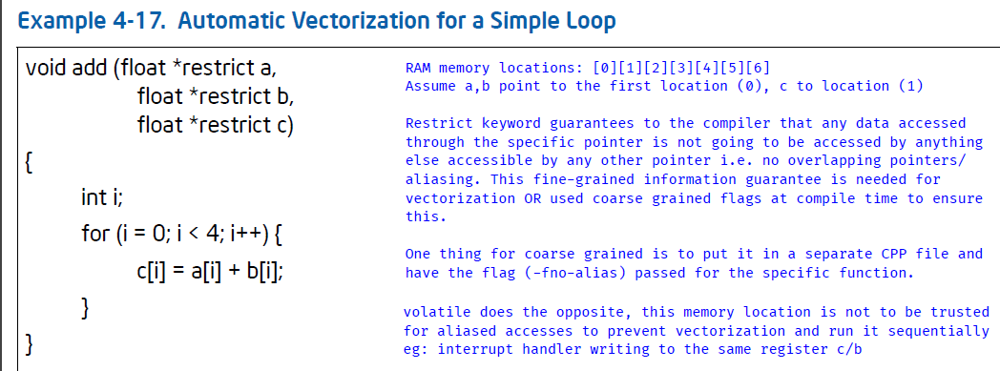
- Pay attention to false-sharing for reduction
- Floating point can wrap-around on overflow, this is why double precision is used.

## Perf techniques

- Culprits behind performance: Cache capacity and partial utilization of lines (measure effective bandwidth using code-instrumentation than hardware monitors that give total bandwidth)
- Assembly:
  - Pros:
    - Potential for performance acceleration
    - Direct control over code generated by compiler
  - Cons:
    - Impractical for large sections of code
    - Not portable across ISAs
    - User needs to perform register allocation (and save from old registers)
    - User needs to schedule instructions to hide latency
- Intrinsics:
  - Pros:
    - Compiler takes care of register allocation (and spill, if needed)
    - Compiler takes care of shuffle & schedule instructions to hide latency
    - Relatively portable and easy migration SSE <-> AVX
    - Even ok to use more “vector” variables than available on processor (the compiler will take care of stashing “spilling” them to temporary memory)
  - Cons:
    - Impractical for large sections of code
    - Un-natural notation
    - Scalar code different from vector code
  - Autovectorization:
    - Cons:
      - very challenging to achieve efficiency comparable to assembly/intrinsics
      - Compilers are very conservative when vectorizing, for the risk of jeopardizing scalar equivalence
      - No-aliasing restriction might run contrary to intent of certain kernels
- Storage formats
  - CSR 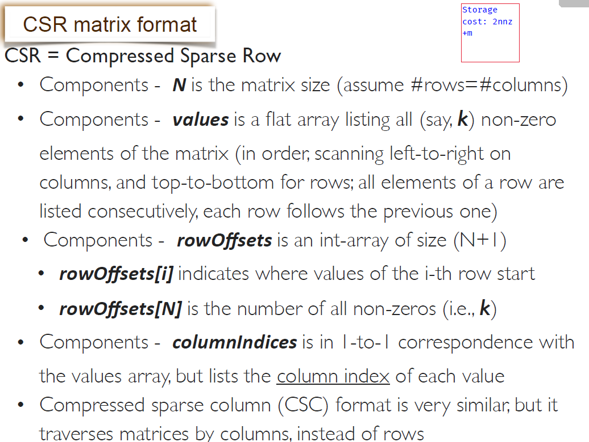 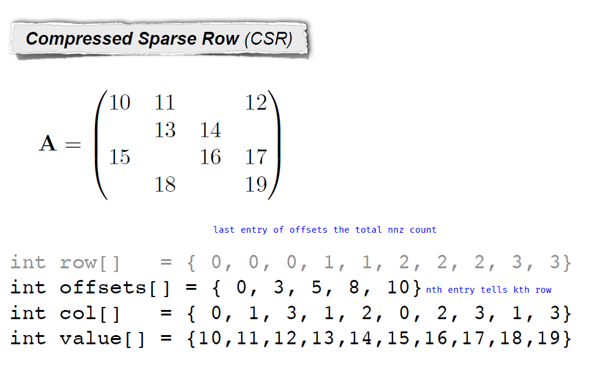
  - OpenVDB

## Computation types

### Stencils

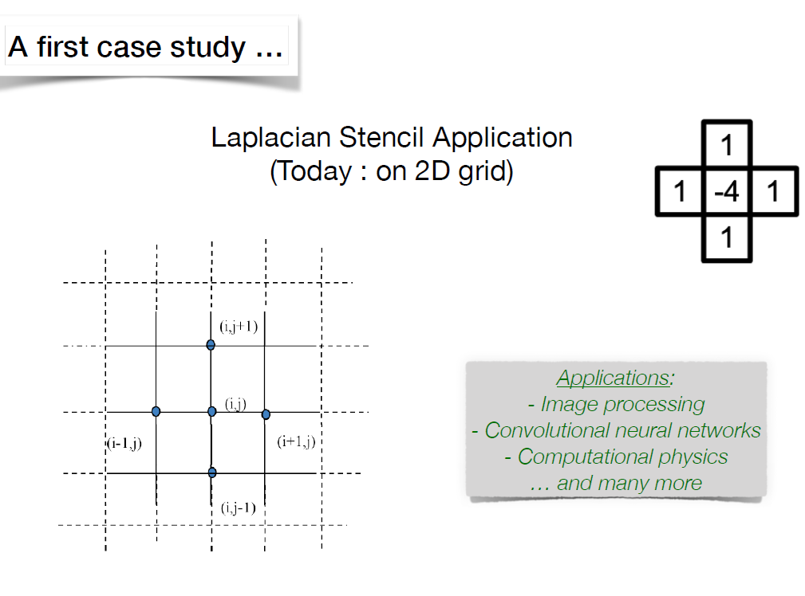

- Memory bound since it relies on neighboring memory locations in all directions

### Matrices for Linear sparse systems (Ax=b)

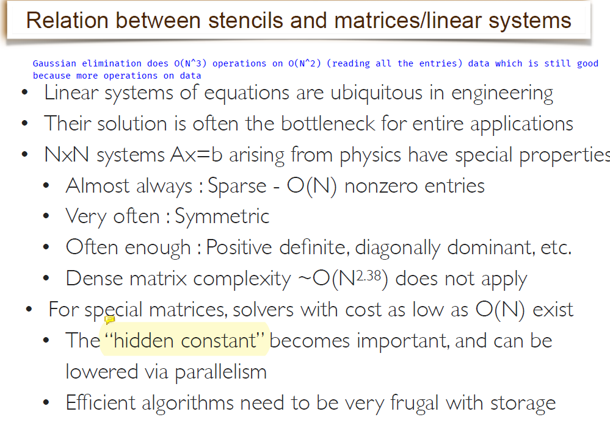
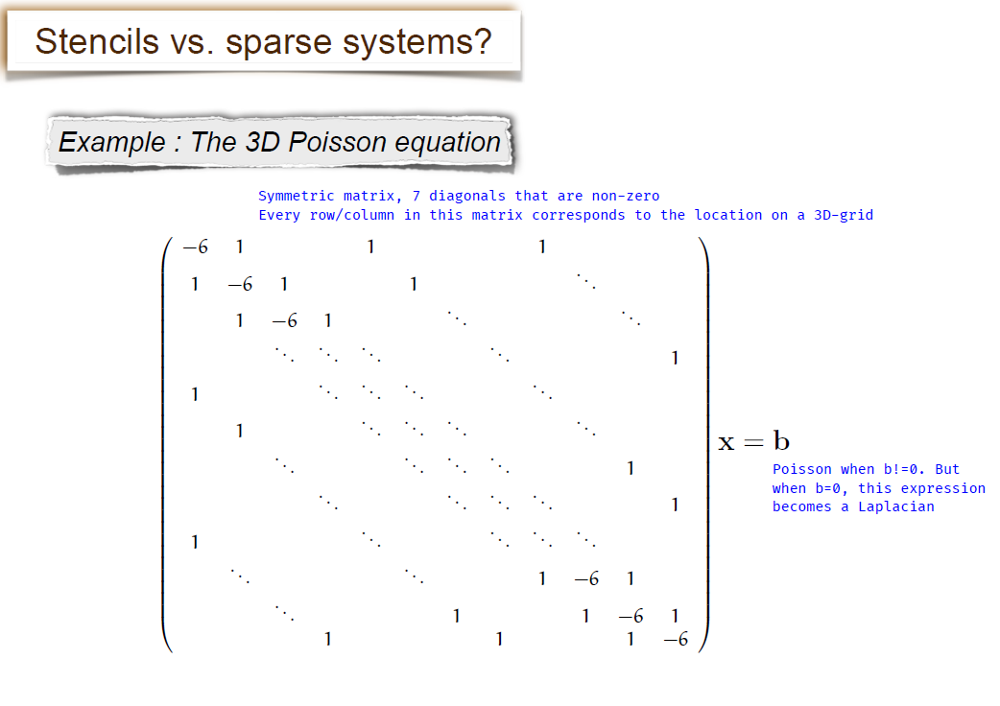
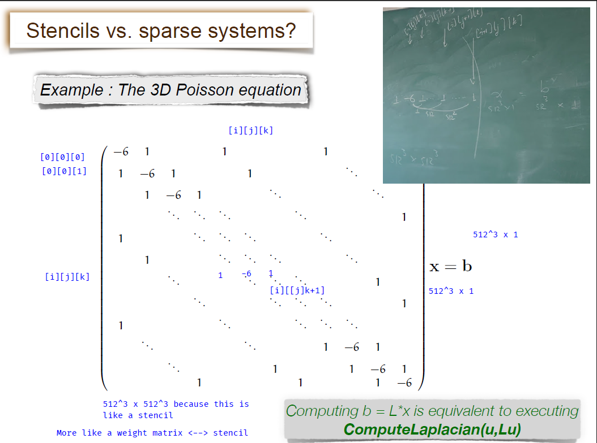
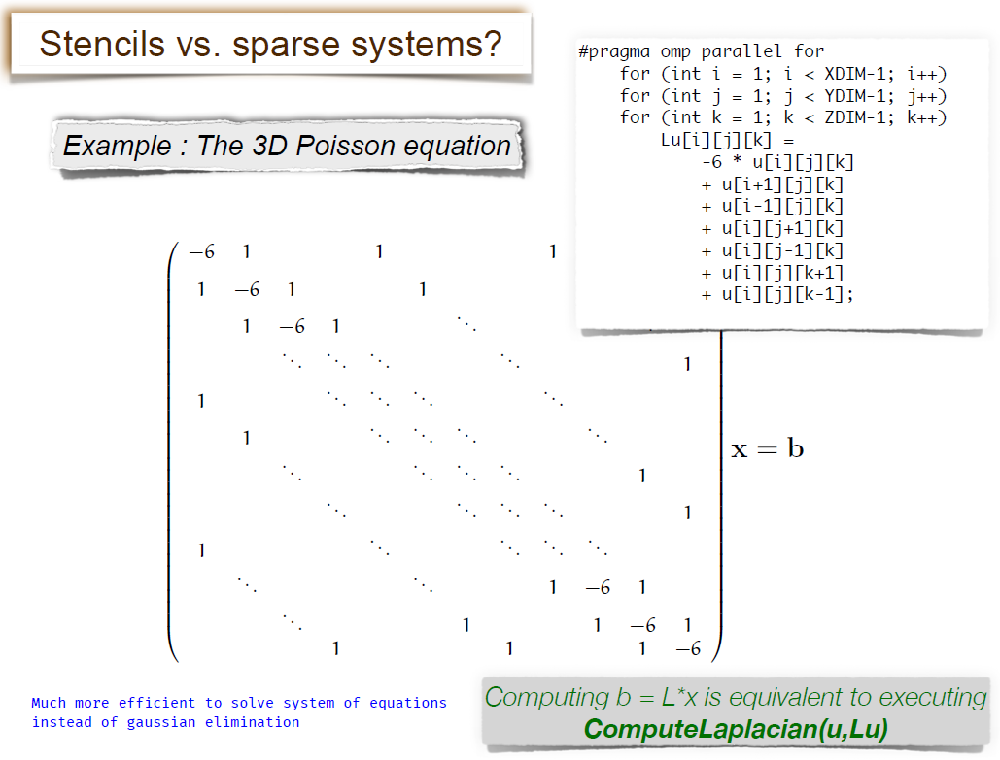
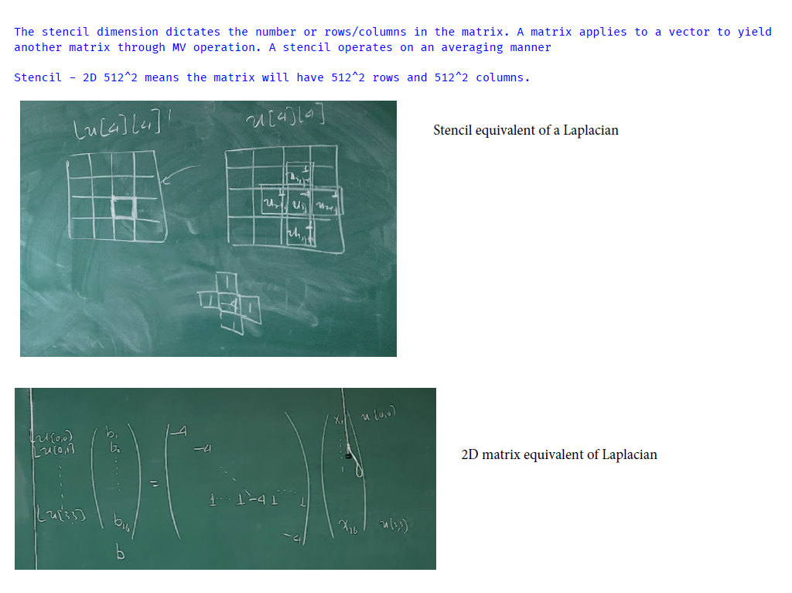
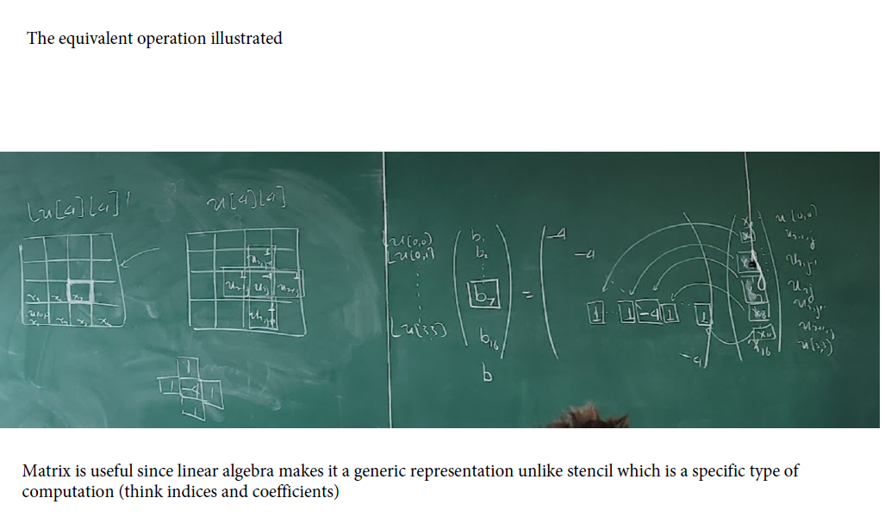

- The storage overhead of the matrix is represented by the fact that a single value read is at the most used in one addition and one multiplication which makes it a bottleneck compared to stencil solvers that compress the coefficients into a single set of scalars
- CG was an alternative to MatrixVectorMUL without the overhead of storing the matrices that made it compute bound. This was possible because of the fixed 6 locations in Laplacian.

### GEMM

- Optimizations
  - Aligned allocation (at cacheline boundary)
    - `float *Araw = static_cast<float*>(AlignedAllocate(MATRIX_SIZE*MATRIX_SIZE*sizeof(float),64));`
		```c
			void* AlignedAllocate(const std::size_t size, const std::size_t alignment)
		{
		std::size_t capacity = size + alignment - 1;
		void *ptr = new char[capacity];
		auto result = std::align(alignment, size, ptr, capacity);
		if (result == nullptr) throw std::bad_alloc();
		if (capacity < size) throw std::bad_alloc();
		return ptr;
		}
		```
	- Recast the allocated memory to a “matrix” that can be indexed just like an array `matrix_t A = reinterpret_cast<matrix_t>(*Araw);`
	- Blocking 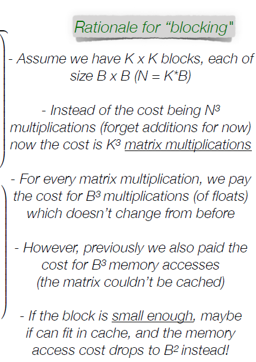
    	- With very large BLOCK_SIZES, the parallelism is limited because of being compute bound given the large number of rows. However, oversubscription when it comes to parallelism is generally preferred. Smaller than cache line sizes are considered bad for performance due to lack of reuse
	- Transpose 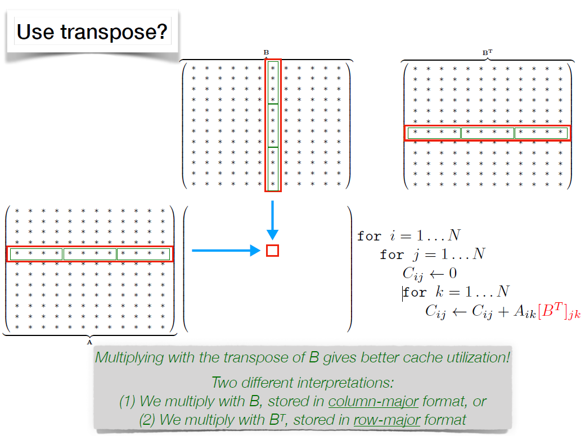

### Direct Solvers

Solvers for linear systems (Ax = b) come in two (main) flavors:

- Iterative solvers (e.g. Conjugate Gradients) that converge to the solution after a number of iterations (hopefully not too many …)
- Direct solvers produce the solution without iteration, by following a set algorithm that does not involve progressive “improvement” of a guess (e.g. Gauss Elimination, or Forward/Backward substitution when applicable)
- Triangular, dense or sparse, system solvers (BLAS Level 2/3) (Pros: Inexpensive, parallel when dense; Cons: Limited scope, memory bound)

Pros of iterative methods :

- Relatively easy to set-up, as a general rule they don’t require much pre-computation to be used
- Some can be used without building the matrix explicitly (as in our earlier use of Conjugate Gradients)
- Parallelizable

Cons:

- They may require many, many iterations to converge (“pre-conditioners” help, but are difficult to design)
- Some matrices can be particularly bad for them (it can be common that you need to use double-precision computation to barely get single-precision accurate results)

Pros of direct methods :

- No need to worry about how many iterations it will take (they “just” work …)
- In many cases they are capable of computing solutions to higher accuracy, even for some “bad/problematic” matrices
- Parallelizable

Cons:

- Restricted to small matrices
- They require significant amounts of computation (up to O(N3) for systems with N equations and N unknowns)
- Pre-computation often required, which is only amortized if solving for many right-hand sides ??? Parallel Potential: Relatively easy to leverage for dense systems, much more challenging for sparse systems.

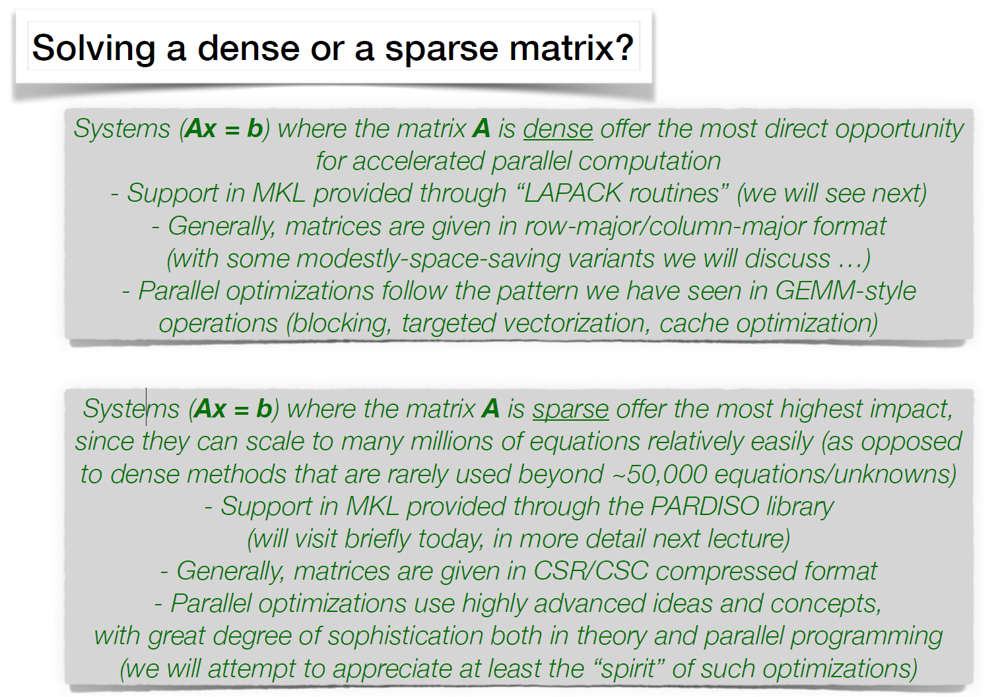

- PARDISO
  - Most commonly used for symmetric matrices
    - Can either be positive definite or not (takes advantage if they are)
    - Also works for non-symmetric matrices (slightly less efficiently)
  - The solver works for several different types of matrices, but is particularly efficient for symmetric (and, ideally, positive definite) matrices for which a factorization of A is computed once (the “Cholesky” decomposition, when applicable)
and re-used at low-cost for solving with different right-hand-sides
  - Once factorization is computed solution to Ax=b is obtained via forward/backward substitution
  - PARDISO operates on CSR-encoded matrices - same as we used before (but when used with symmetric matrices expects to be given just “half” matrix)
  - The solver is “direct”, in that it computes the entire solution without the need for iteration
  - **Engineering sparsity**
    - Gaussian elimination is used to convert matrices into upper/lower triangular formats.
    - Reordering: reduces sparsity of factors, creates independent blocks with similar sparsity patterns, allows serial operation like Gaussian elimination to be better
  - Cholesky Factorization works with symmetric matrices ONLY. PARDISO does the internal book-keeping for non-symmetric matrices.

- Phase 1 (Controls Matrix Density): Reorder the matrix to generate favorable properties No numerical operations done in this stage - values of matrix entries don’t matter, the only thing that matters is the sparsity pattern (we’ll see what those “favorable properties” are)
- Phase 2 (Controls multithreading, similar to Gaussian, very serial): Perform the actual Cholesky Decomposition (factorization) This is the computation-heavy part of the algorithm, and the most expensive part of the execution, for typical (large) matrix sizes. Note: In accordance with theory, the Cholesky factor L includes all of the entries in the sparsity pattern of A in its own, plus some more (hopefully as few as possible; reordering influences that)

Compute LU factrorization is similar to GEMM

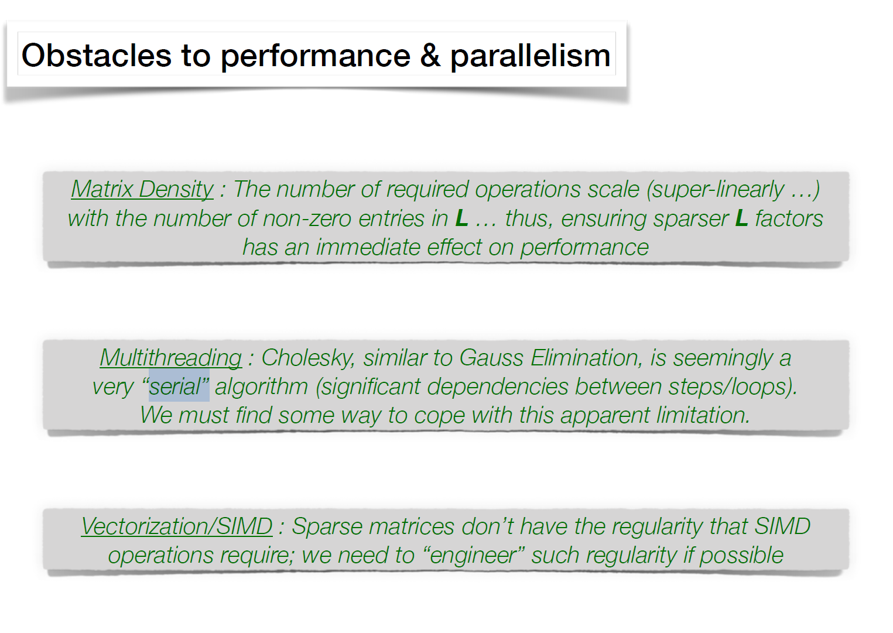
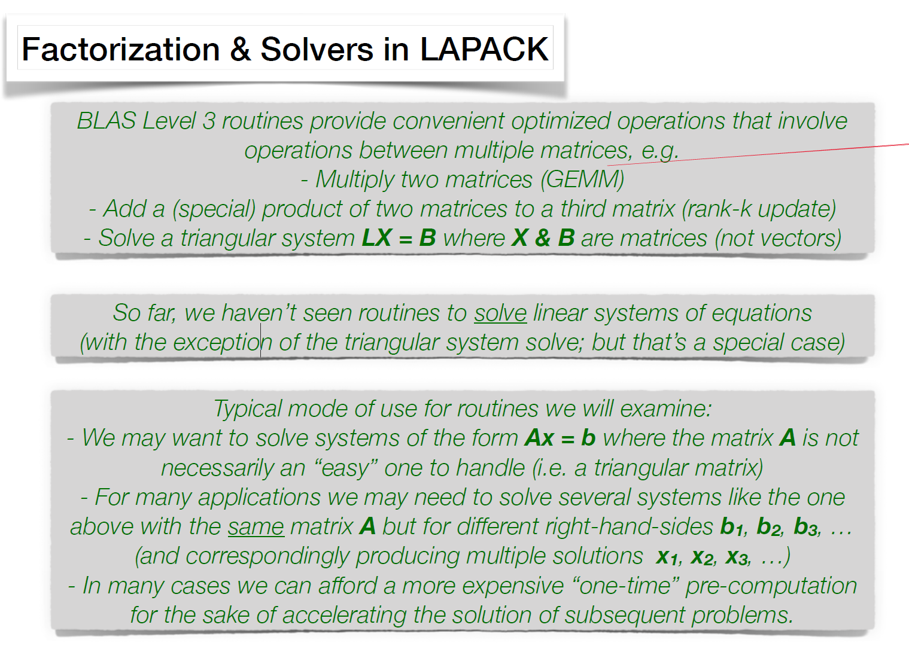